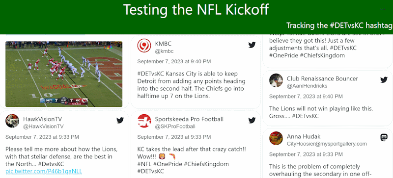

# TagzApp
A new website tool that searches social media for hashtags, and tracks chat interaction on several live streaming services

### Overlay display

When some content is selected on the waterfall display, we have an overlay available that can be used with a video capture device

## Current Status

We have completed an initial minimum viable product and stress tested the application by capturing tweets during the NFL kickoff grame on September 7, 2023 between Kansas City and Detroit using the hashtag #DETvsKC

Data is stored in a combination of Sqlite and Postgres databases.  We have configured an extensive provider model so that we can add new social media services in the future.

Live chat integration (TwitchChat, YouTubeChat, etc) captures all messages that are delivered over that service.

We also have a simple moderation capability.

## Keyboard navigation supported on moderation screen

On the moderation screen, you can use the keyboard to navigate the cards on screen:

- arrows to move a cursor between the various messages
- Enter to select a message for moderation
- Y to approve a message
- N to reject a message

### Currently Supported Services

 - [Blazot](https://www.blazot.com/)
 - Bluesky
 - Mastodon
 - Twitter / X
 - TwitchChat
 - YouTube (search for videos that have a given hashtag in the description)
 - Custom message delivery across Azure Queues, labeled as 'Website'

