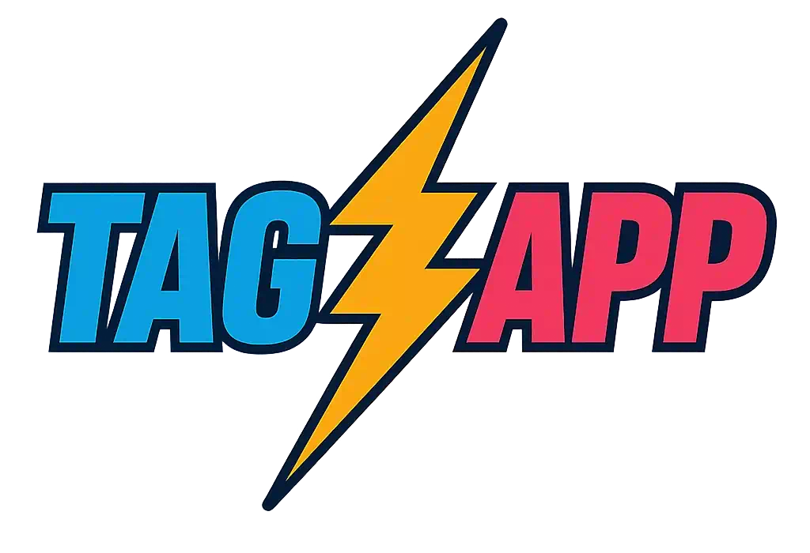

# 

A new website tool that searches social media for hashtags, and tracks chat interaction on several live streaming services


### Overlay display

When some content is selected on the waterfall display, we have an overlay available that can be used with a video capture device


## Current Status

We have completed an initial minimum viable product and stress tested the application by capturing tweets during the NFL kickoff grame on September 7, 2023 between Kansas City and Detroit using the hashtag #DETvsKC

Data is stored in a combination of Sqlite and Postgres databases.  We have configured an extensive provider model so that we can add new social media services in the future.

Live chat integration (TwitchChat, YouTubeChat, etc) captures all messages that are delivered over that service.

We also have a simple moderation capability.

## Keyboard navigation supported on moderation screen

On the moderation screen, you can use the keyboard to navigate the cards on screen:

- arrows to move a cursor between the various messages
- Enter to select a message for moderation
- Y to approve a message
- N to reject a message

### Currently Supported Services

 - [Blazot](https://www.blazot.com/)
 - Bluesky
 - Mastodon
 - Twitter / X
 - TwitchChat
 - YouTube (search for videos that have a given hashtag in the description)
 - YouTube Live Chat
 - Custom message delivery across Azure Queues, labeled as 'Website'

## Integrating TagzApp with Your Application using Azure Storage Queues

The `MessageClient` class, provided by the `TagzApp.Lib.AzureQueue` package, enables seamless integration of your application or website with TagzApp by leveraging Azure Storage Queues. This allows you to send messages that will appear on TagzApp in real-time. Ensure that the `TagzApp.Lib.AzureQueue` package is installed in your project before proceeding.

### Steps to Configure and Use the MessageClient

1. **Set Up Azure Queue**:
   - Create an Azure Storage account if you don't already have one.
   - Create a queue in the Azure Storage account.
   - Note down the connection string and queue name.

2. **Integrate MessageClient in Your Application**:
   - Add a reference to the `TagzApp.Lib.AzureQueue` library in your project.
   - Use the `MessageClient` class to send messages to the Azure Queue.

3. **Code Example**:
   ```csharp
   using TagzApp.Lib.AzureQueue;

   // Initialize the MessageClient with your Azure Storage connection string and queue name
   var messageClient = new MessageClient("<YourConnectionString>", "<YourQueueName>");

   // Submit a message to the queue
   await messageClient.SubmitMessage("Hello, TagzApp!", "AuthorName");
   ```

4. **Run Your Application**:
   - Ensure your application has network access to the Azure Storage account.
   - Messages sent using the `MessageClient` will appear on TagzApp with a globe icon for the provider.

## Running a local environment for development 

The application has been updated to work with .NET Aspire and will start with a Postgres container and support for Mastodon.  With the .NET CLI installed, you can start the application using:

```bash
dotnet run --project src/AppHost
```

If you have the Aspire CLI installed, you can run a local instance with:

```bash
aspire run
```