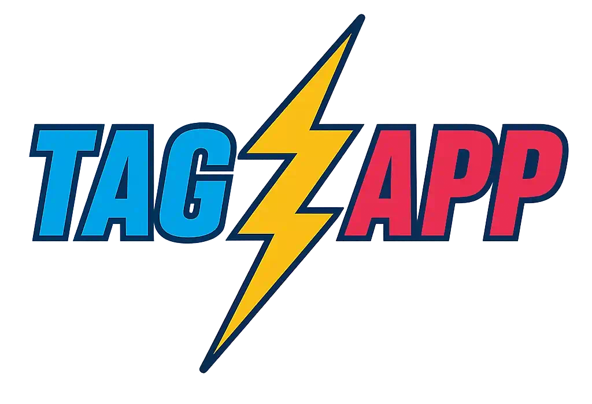
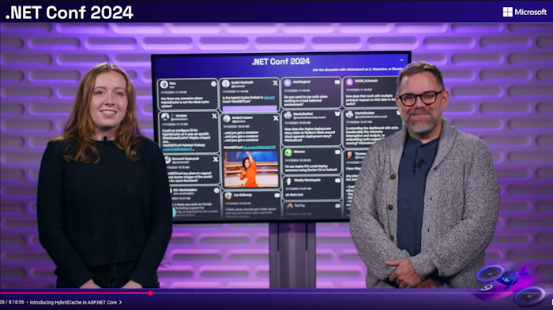

# 

A website tool that searches social media for hashtags, and tracks chat interaction on several live streaming services

<!-- ALL-CONTRIBUTORS-BADGE:START - Do not remove or modify this section -->

<!-- ALL-CONTRIBUTORS-BADGE:END -->

### Overlay display

When some content is selected on the waterfall display, we have an overlay available that can be used with a video capture device

## Current Features

TagzApp has been successfully deployed and proven in production for major .NET community events, having powered the social media aggregation for both **.NET Conf 2023** and **.NET Conf 2024**. The application has demonstrated its reliability and scalability in handling high-volume, real-time social media content during these large-scale developer conferences.

### Production-Proven Features

#### Social Media Provider Support
TagzApp currently supports **seven different social media providers**, offering comprehensive coverage across major platforms:
- **[Blazot](https://www.blazot.com/)** - Developer-focused social platform
- **Bluesky** - Decentralized social networking
- **Mastodon** - Federated social network  
- **Twitter/X** - Major social media platform
- **TwitchChat** - Live streaming chat integration
- **YouTube** - Video search by hashtag in descriptions
- **YouTube Live Chat** - Real-time chat during live streams
- **Azure Queue Integration** - Custom message delivery for website integration

#### Advanced Moderation Capabilities
The application features a comprehensive moderation system designed for high-traffic events:

- **Multi-layered content review** with human moderator oversight
- **Keyboard navigation support** for efficient moderation workflows
- **Real-time approval/rejection** with immediate visual feedback
- **Bulk moderation actions** for managing high-volume content streams
- **User blocking capabilities** with granular control options

#### Azure Content Safety Integration
TagzApp incorporates **automated AI-powered moderation** through Azure Content Safety:

- **Automated initial screening** of all incoming content across four critical categories:
  - Sexual content detection
  - Hate speech identification  
  - Self-harm content flagging
  - Violence-related content filtering
- **Severity-based automatic rejection** with configurable thresholds
- **Human moderator override capabilities** for nuanced decision-making
- **Detailed AI reasoning** provided to moderators for informed review
- **24/7 automated protection** ensuring continuous content monitoring

#### Professional Overlay System
Multiple overlay formats are available for live streaming and broadcast integration:

- **Landscape Overlay** (`/overlay`) - Optimized for widescreen displays and OBS integration
- **Portrait Overlay** (`/PortraitOverlay`) - Designed for mobile-friendly and vertical layouts  
- **Real-time content selection** - Content selected on the waterfall automatically appears on overlays
- **Video capture device compatibility** - Seamless integration with streaming software
- **Customizable styling** with CSS configuration options
- **Preview capabilities** for testing before going live

#### Technical Architecture
Built on modern .NET technologies for scalability and performance:

- **.NET 9** with Blazor Server and WebAssembly hybrid architecture
- **SignalR** for real-time communication and live updates
- **PostgreSQL** for robust data storage and management
- **.NET Aspire** for cloud-native application orchestration
- **Azure integration** for cloud deployment and scaling
- **Docker support** for containerized deployments

#### Features Ready for Your Next Event
- **Role-based access control** with admin and moderator permissions
- **Single-user mode** for smaller events or private instances  
- **Extensive configuration management** with database-backed settings
- **Telemetry and monitoring** integration for production observability
- **Responsive design** optimized for desktop and mobile moderation workflows

## Contributing or running in development mode

If you want to run your own version of TagzApp locally, check out the [CONTRIBUTING.md](CONTRIBUTING.md) document

## Contributors ✨

<!-- ALL-CONTRIBUTORS-LIST:START - Do not remove or modify this section -->
<!-- prettier-ignore-start -->
<!-- markdownlint-disable -->
<table>
  <tbody>
    <tr>
      <td align="center" valign="top" width="14.28%"><a href="https://github.com/csharpfritz"> <b>Jeffrey T. Fritz</b></a> <a href="https://github.com/FritzAndFriends/TagzApp/commits?author=csharpfritz" title="Code">💻</a></td>
      <td align="center" valign="top" width="14.28%"><a href="https://github.com/degenone"> <b>Tero Kilpelainen</b></a> <a href="https://github.com/FritzAndFriends/TagzApp/commits?author=degenone" title="Code">💻</a></td>
      <td align="center" valign="top" width="14.28%"><a href="https://github.com/Stelzi79"> <b>Stelzi79</b></a> <a href="https://github.com/FritzAndFriends/TagzApp/commits?author=Stelzi79" title="Code">💻</a></td>
      <td align="center" valign="top" width="14.28%"><a href="https://github.com/NapalmCodes"> <b>Shawn Vause</b></a> <a href="https://github.com/FritzAndFriends/TagzApp/commits?author=NapalmCodes" title="Code">💻</a></td>
      <td align="center" valign="top" width="14.28%"><a href="https://github.com/CZEMacLeod"> <b>Cynthia MacLeod</b></a> <a href="https://github.com/FritzAndFriends/TagzApp/commits?author=CZEMacLeod" title="Code">💻</a></td>
      <td align="center" valign="top" width="14.28%"><a href="https://github.com/ElliottBrand"> <b>Steve Elliott</b></a> <a href="https://github.com/FritzAndFriends/TagzApp/commits?author=ElliottBrand" title="Code">💻</a></td>
      <td align="center" valign="top" width="14.28%"><a href="https://github.com/JBraunsmaJr"> <b>Badger</b></a> <a href="https://github.com/FritzAndFriends/TagzApp/commits?author=JBraunsmaJr" title="Code">💻</a></td>
    </tr>
    <tr>
      <td align="center" valign="top" width="14.28%"><a href="https://github.com/eric-vanartsdalen"> <b>Eric VanArtsdalen</b></a> <a href="https://github.com/FritzAndFriends/TagzApp/commits?author=eric-vanartsdalen" title="Code">💻</a></td>
      <td align="center" valign="top" width="14.28%"><a href="https://github.com/paddybhoy66"> <b>Pat Woods</b></a> <a href="https://github.com/FritzAndFriends/TagzApp/commits?author=paddybhoy66" title="Code">💻</a></td>
      <td align="center" valign="top" width="14.28%"><a href="https://github.com/SQL-MisterMagoo"> <b>SQL-MisterMagoo</b></a> <a href="https://github.com/FritzAndFriends/TagzApp/commits?author=SQL-MisterMagoo" title="Code">💻</a></td>
      <td align="center" valign="top" width="14.28%"><a href="https://github.com/mpaulosky"> <b>mpaulosky</b></a> <a href="https://github.com/FritzAndFriends/TagzApp/commits?author=mpaulosky" title="Code">💻</a></td>
      <td align="center" valign="top" width="14.28%"><a href="https://github.com/mcNets"> <b>Joan Magnet</b></a> <a href="https://github.com/FritzAndFriends/TagzApp/commits?author=mcNets" title="Code">💻</a></td>
      <td align="center" valign="top" width="14.28%"><a href="https://github.com/johanbenschop"> <b>Johan Benschop</b></a> <a href="https://github.com/FritzAndFriends/TagzApp/commits?author=johanbenschop" title="Code">💻</a></td>
      <td align="center" valign="top" width="14.28%"><a href="https://github.com/jedelfraisse"> <b>Jonathan Delfraisse</b></a> <a href="https://github.com/FritzAndFriends/TagzApp/commits?author=jedelfraisse" title="Code">💻</a></td>
    </tr>
    <tr>
      <td align="center" valign="top" width="14.28%"><a href="https://github.com/justinhhorner"> <b>Justin Horner</b></a> <a href="https://github.com/FritzAndFriends/TagzApp/commits?author=justinhhorner" title="Code">💻</a></td>
      <td align="center" valign="top" width="14.28%"><a href="https://github.com/NickSpaghetti"> <b>Nick Spaghetti</b></a> <a href="https://github.com/FritzAndFriends/TagzApp/commits?author=NickSpaghetti" title="Code">💻</a></td>
      <td align="center" valign="top" width="14.28%"><a href="https://github.com/mogas"> <b>Nuno Silva</b></a> <a href="https://github.com/FritzAndFriends/TagzApp/commits?author=mogas" title="Code">💻</a></td>
      <td align="center" valign="top" width="14.28%"><a href="https://github.com/szalapski"> <b>Patrick Szalapski</b></a> <a href="https://github.com/FritzAndFriends/TagzApp/commits?author=szalapski" title="Code">💻</a></td>
      <td align="center" valign="top" width="14.28%"><a href="https://github.com/acidrod"> <b>Rodrigo Alarcon</b></a> <a href="https://github.com/FritzAndFriends/TagzApp/commits?author=acidrod" title="Code">💻</a></td>
      <td align="center" valign="top" width="14.28%"><a href="https://github.com/ryanshaut"> <b>Ryan Shaut</b></a> <a href="https://github.com/FritzAndFriends/TagzApp/commits?author=ryanshaut" title="Code">💻</a></td>
      <td align="center" valign="top" width="14.28%"><a href="https://github.com/ThindalTV"> <b>Thindal</b></a> <a href="https://github.com/FritzAndFriends/TagzApp/commits?author=ThindalTV" title="Code">💻</a></td>
    </tr>
  </tbody>
</table>

<!-- markdownlint-restore -->
<!-- prettier-ignore-end -->

<!-- ALL-CONTRIBUTORS-LIST:END -->
