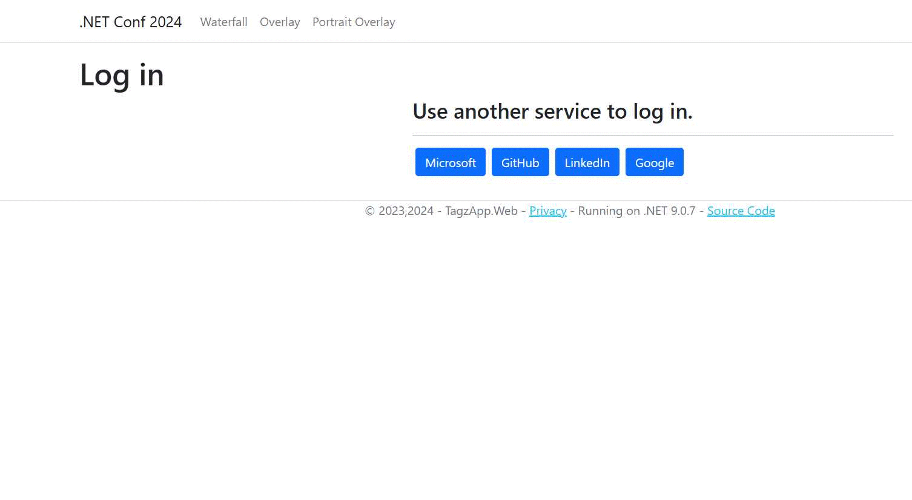
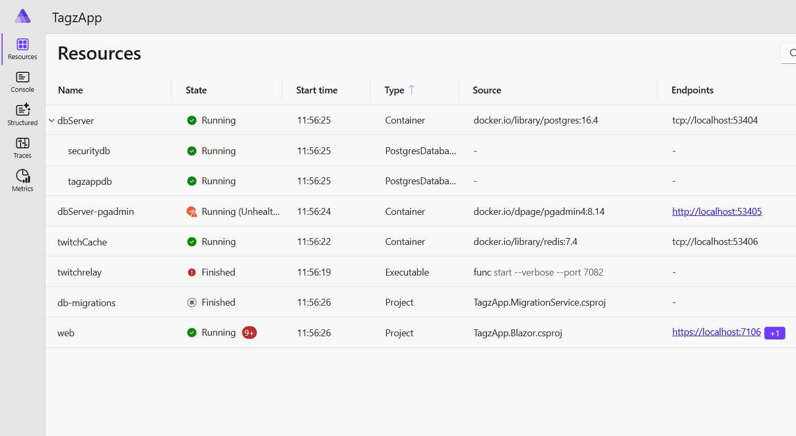
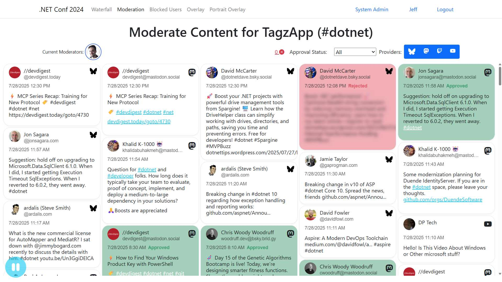
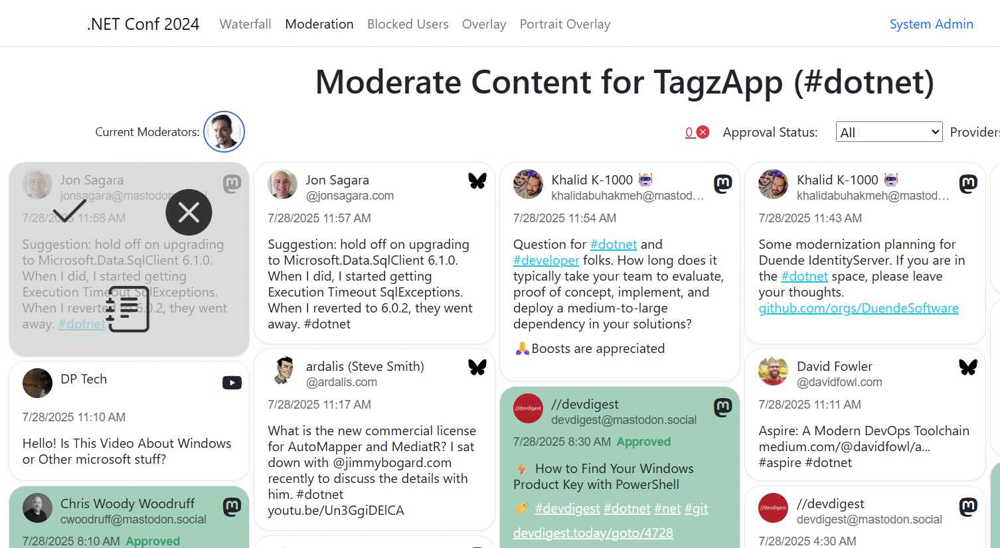
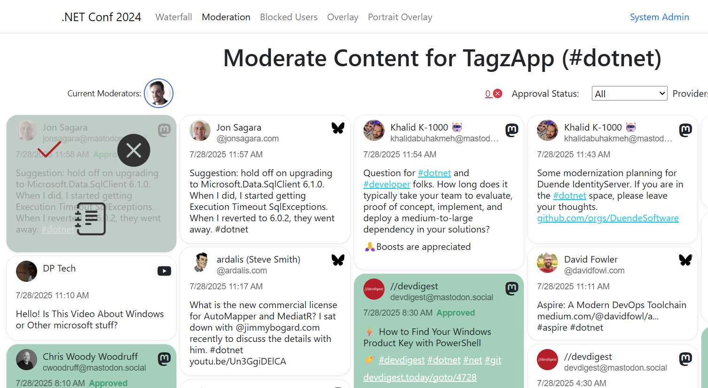
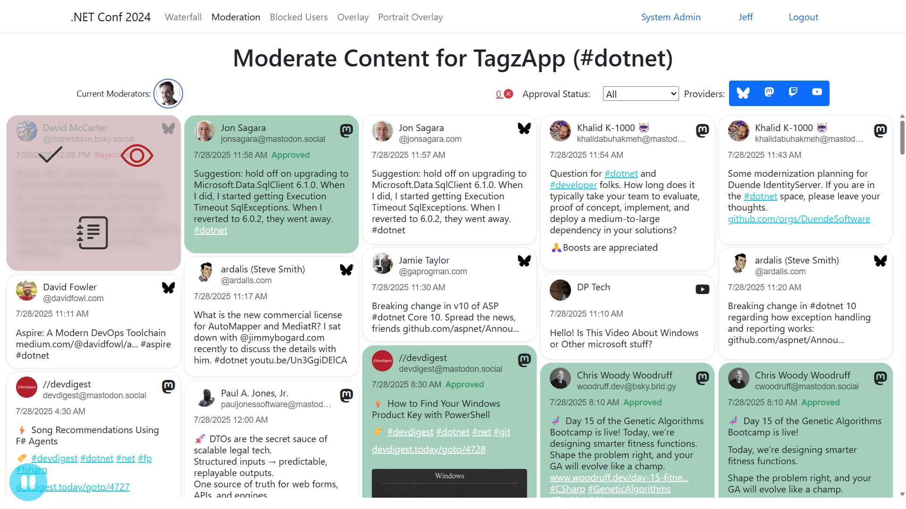
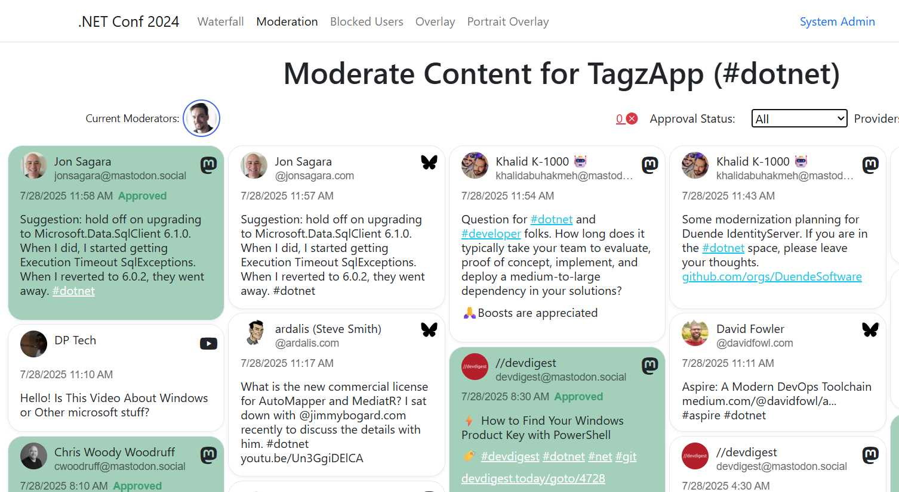
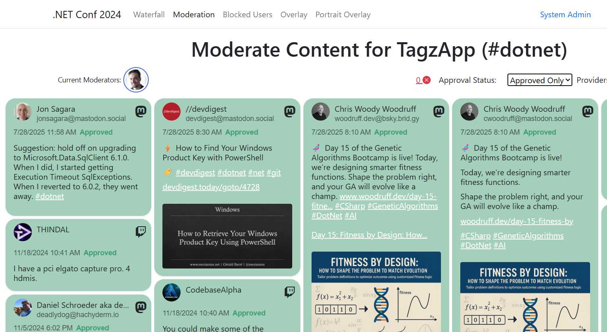
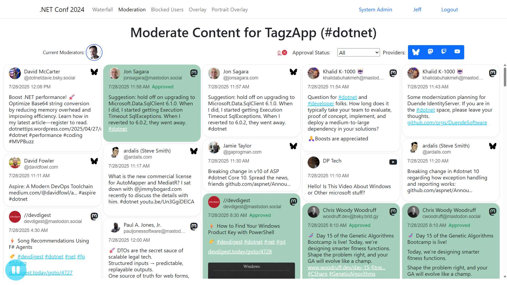
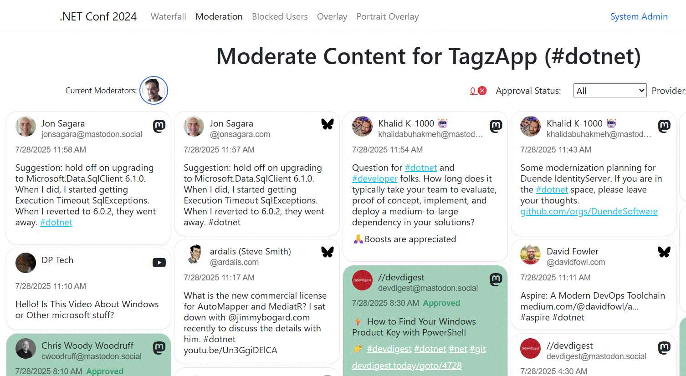

# TagzApp Moderator User Manual

## Overview

TagzApp is a social media aggregation platform that allows you to track and display content from multiple social media platforms using hashtags. As a moderator, you have the responsibility to review, approve, or reject content before it appears on the main display.

This manual will guide you through the moderation interface and help you understand how to effectively moderate content in TagzApp.

## Accessing the Moderation Interface

To access the moderation interface, you need to:

1. Have moderator privileges assigned to your account
2. Navigate to the TagzApp application (when running via Aspire, typically at `https://localhost:7106`)
3. Attempt to access the `/Moderation` page - you will be redirected to login if not authenticated
4. Log in using one of the supported external authentication providers:
   - Microsoft
   - GitHub  
   - LinkedIn
   - Google

*Figure 1: TagzApp authentication page showing external login providers*

### Development Environment Access

When running TagzApp in development mode using .NET Aspire:

1. Start the application using the AppHost project: `dotnet run` from the `TagzApp.AppHost` directory
2. Access the Aspire dashboard at the URL shown in the console output (typically `https://localhost:17060`)
3. Find the "web" service in the dashboard to get the application URL
4. Navigate to the application URL and then to `/Moderation`

*Figure 2: .NET Aspire dashboard showing running services and endpoints*

## Moderation Interface Overview

As a moderator, your job is to review the content that is arriving from all of the different social media platforms and to prove those messages that will be visible publicly on the waterfall interface.  Approved messages will be highlighted in green with an approved status appearing inside the card, and rejected messages will appear in read with a rejected message appearing inside the card.
 read with a rejected message appearing inside the card. read with a rejected message appearing inside the card.

Messages will appear automatically from the top left of the screen as they are discovered by TagzApp on the connected social media services. If messages are arriving too quickly, you can press the pause button in the bottom left corner of the screen. Don't forget to unpause When you're ready to resume viewing fresh content flowing on the screen.

The moderation interface consists of several key areas:

### 1. Header Information
- **Current Tag**: Shows the hashtag being moderated (e.g., @tagname)
- **Current Moderators**: Displays profile pictures of all moderators currently online
- **Blocked Users Count**: Shows the number of currently blocked users with a link to manage them

### 2. Filter Controls

#### Approval Status Filter
You can filter content by its moderation status:
- **All**: Shows all content regardless of status
- **Approved Only**: Shows only approved content
- **Rejected Only**: Shows only rejected content  
- **Needs Review**: Shows only content pending moderation

#### Provider Filters
Toggle buttons to show/hide content from specific social media platforms:
- Each platform is represented by its icon (Twitter/X, Mastodon, YouTube, etc.)
- Click to toggle visibility of content from that provider
- All providers are enabled by default

### 3. Content Display Area

Content is displayed in a waterfall layout with the latest messages appearing in the top-left corner and flowing right, then down. Each message appears as a card containing:

#### Message Information
- **Author Profile Picture**: Shows the user's avatar
- **Author Display Name**: The user's display name
- **Author Username**: The user's handle/username (if different from display name)
- **Provider Icon**: Indicates which social platform the content came from
- **Timestamp**: When the content was posted
- **Content Text**: The actual message content with formatted links and emotes
- **Media Attachments**: Images or videos embedded in the post

#### Moderation Status Indicators
Messages are visually distinguished by their moderation status:
- **Pending**: Normal appearance, needs review
- **Approved**: Green checkmark styling
- **Rejected**: Red X styling with blurred content
- **Auto-Moderated**: Content rejected by AI safety systems with specific styling

#### Auto-Moderation Information
When Azure Content Safety has flagged content, you'll see:
- **AI Moderator**: "AZURE-CONTENTSAFETY" listed as the moderator

### Interface Visual Example

Below is a clean view of the moderation interface showing different message states:

In this interface view, you can see:
- **White/Light Cards**: Pending messages awaiting moderation decisions
- **Green Cards**: Approved messages that are publicly visible
- **Pink/Red Cards**: Rejected messages that are hidden from public view
- **Real-time Updates**: The interface automatically updates as new content arrives and moderation decisions are made
- **AI Reason**: Shows the safety categories and severity levels that triggered the rejection
  - Categories include: Sexual, Hate, SelfHarm, Violence
  - Severity levels: Low (2), Medium (4), High (6)
  - Example: "Sexual: 4. Hate: 2." indicates Medium-level sexual content and Low-level hate speech
- **Special Styling**: Auto-rejected content appears blurred and with distinct visual indicators
- **Override Capability**: Moderators can still approve auto-rejected content using the standard moderation controls

*See the [Azure Content Safety Integration](#azure-content-safety-integration) section for detailed information about how AI-assisted moderation works.*

### 4. Pause Button
A pause button in the bottom left corner allows you to temporarily stop new content from appearing while you review current items.

## Moderation Actions

### Individual Message Moderation

When you hover over a message, moderation controls appear:

#### Primary Actions
- **Approve (✓)**: Marks content as approved for public display
- **Reject (✗)**: Marks content as rejected and hides it from public display
- **Reveal (👁)**: For rejected content, temporarily shows the full content

#### Additional Actions
- **More Actions (📄)**: Opens detailed message view with additional options

### Moderation Workflows

#### Approving Content

When content needs review, hover over the message to reveal moderation controls:

To approve a message:
1. Click the **checkmark (✓)** button to approve the content
2. The message status will change to "Approved" 
3. The content becomes visible to all users on the waterfall display

The approved content will show a green "Approved" status indicator, and the moderation controls will change to show options for further actions if needed.

#### Rejecting Content

To reject inappropriate or unwanted content:

1. Hover over the message to reveal moderation controls
2. Click the **X button** (Reject this content) to reject the message
3. The message status will change to "Rejected"
4. Rejected content is hidden from public view but remains visible to moderators

**Key features of rejected content:**
- Shows "Rejected" status in red text
- Content remains visible to moderators for review purposes  
- The reject button changes to "Reveal this content" allowing you to view the rejected content
- The approve button allows you to approve previously rejected content, and will prompt you to confirm you would like it displayed publicly
- Rejected messages do not appear on the public waterfall display
- You can use the "Approval Status" filter to view only rejected content

### Keyboard Navigation

The moderation interface supports keyboard shortcuts for efficient reviewing:

- **Arrow Keys**: Navigate between messages
- **Enter**: Select a message for detailed review
- **Y**: Approve the currently selected message
- **N**: Reject the currently selected message

### Confirmation Dialogs

The system provides confirmation dialogs for important actions:
- When approving previously rejected content
- When rejecting previously approved content

## Content Filtering

### Filter Options

The moderation interface provides powerful filtering options to help organize and manage content efficiently:

#### Approval Status Filter
The approval status dropdown allows you to view content based on its moderation state:

- **All** (default view): Shows all content regardless of status
- **Approved Only**: Shows only content that has been approved
- **Rejected Only**: Shows only content that has been rejected  
- **Needs Review**: Shows only content that hasn't been moderated yet

You can select different filter options by:
- Clicking on the dropdown to see all options
- Using keyboard navigation (arrow keys) to select different filters

When you select "Approved Only", the interface updates to show only approved content:

#### Provider Filters
Use the provider checkboxes to filter content by social media platform:
- Toggle individual platforms on/off
- Useful for focusing on specific content sources
- All providers are enabled by default

The provider filter buttons are located on the right side of the interface and include:
- **Bluesky** (bird icon)
- **Mastodon** (@symbol icon)
- **Twitter/X** (X icon)
- **YouTube** (play button icon)

Each provider button can be toggled independently to show or hide content from that specific platform.

## User Management

### Blocking Users

From the message details view, you can block users with different capability levels:

#### Blocking Capabilities
- **Moderated**: User's content requires moderation review
- **Hidden**: User's content is completely hidden from the system

#### Blocking Process
1. Click "More Actions" on a message
2. Navigate to the message details page
3. Select the blocking capability level
4. Click "Go" to block the user

### Managing Blocked Users

Access the blocked users management page via the blocked users count link:
- View all currently blocked users
- See blocking details (who blocked them, when, expiration)
- Unblock users when appropriate

## Real-Time Updates

The moderation interface uses real-time connections to provide:

### Live Content Updates
- New content appears automatically as it's posted
- Moderation actions by other moderators are reflected immediately
- Blocked user count updates in real-time

### Moderator Awareness
- See which other moderators are currently online
- Notifications when moderators join or leave

### Pause Queue Management
When paused, new content is queued and:
- Shows a counter of queued items
- Releases all queued content when unpaused
- Prevents overwhelming the moderator with rapid content updates

## Content Sources

TagzApp aggregates content from multiple social media platforms:

- **Blazot**: Decentralized social platform
- **Bluesky**: Decentralized social network
- **Mastodon**: Federated social network
- **Twitter/X**: Traditional social media
- **TwitchChat**: Live streaming chat
- **YouTube**: Video platform (searches descriptions for hashtags)
- **YouTube Live Chat**: Live streaming chat
- **Website**: Custom messages via Azure Queues

## Best Practices for Moderators

### Content Review Guidelines
1. **Review Context**: Consider the full context of a message before making decisions
2. **Consistency**: Apply moderation standards consistently across all platforms
3. **Speed vs Accuracy**: Balance quick review with thorough evaluation
4. **Collaboration**: Coordinate with other moderators when possible

### Keyboard Efficiency
- Use keyboard shortcuts for faster moderation
- Navigate with arrow keys and approve/reject with Y/N
- Use the pause function when dealing with high-volume periods

### Managing High Volume
- Use provider filters to focus on specific platforms
- Filter by status to focus on pending content
- Utilize the pause feature during overwhelming periods

### User Blocking Strategy
- Use "Moderated" capability for users who need oversight
- Use "Hidden" capability for users whose content should be completely blocked
- Review blocked users periodically to consider unblocking

## Troubleshooting

### Connection Issues
If the real-time connection fails:
- The system will automatically attempt to reconnect
- Refresh the page if issues persist
- Check your internet connection

### Performance Considerations
- The interface limits display to 100 recent messages for performance
- Use filters to reduce the amount of content displayed
- Pause updates during heavy moderation sessions

## System Integration

### Azure Content Safety Integration

TagzApp integrates with Azure Content Safety to provide automated initial triage of incoming content. This AI-powered service helps protect users by automatically identifying potentially harmful content before it reaches human moderators.

#### How Azure Content Safety Works

Azure Content Safety analyzes all incoming text content in real-time using advanced AI models to detect potentially harmful material across four main categories:

**Content Categories Analyzed:**
- **Sexual**: Sexually explicit or suggestive content
- **Hate**: Hateful, discriminatory, or harassing content  
- **SelfHarm**: Content promoting self-harm or suicide
- **Violence**: Content depicting or promoting violence

**Severity Levels:**
- **Low (2)**: Mild content that may be borderline inappropriate
- **Medium (4)**: Moderately concerning content that likely violates policies
- **High (6)**: Severe content that clearly violates safety policies

#### Automated Triage Process

When new content is received:

1. **Content Processing**: The system strips HTML tags and cleans the text for analysis
2. **AI Analysis**: Azure Content Safety analyzes the cleaned text across all four categories
3. **Automatic Rejection**: If any category returns a severity level above 0, the content is automatically rejected
4. **Moderation Recording**: The system logs the rejection with the specific AI reasoning
5. **Visual Distinction**: Auto-rejected content appears with special styling in the moderation interface

#### Auto-Moderated Content in the Interface

Content that has been automatically rejected by Azure Content Safety appears differently in the moderation interface:

- **Special Styling**: Auto-moderated content has distinct visual styling (blurred by default)
- **AI Moderator**: Shows "AZURE-CONTENTSAFETY" as the moderator
- **Detailed Reasoning**: Displays the specific categories and severity levels that triggered the rejection
- **Example AI Reason**: "Sexual: 4. Hate: 2." (indicating Medium-level sexual content and Low-level hate speech)

#### Moderator Override Capabilities

**Important**: Azure Content Safety serves as an initial filter, not a final decision. Human moderators retain full control:

- **Review Auto-Rejected Content**: All auto-rejected content still appears in the moderation interface
- **Reveal Content**: Use the "Reveal" button (👁) to view blurred auto-rejected content
- **Override Decisions**: Moderators can approve content that was auto-rejected if they determine it's acceptable
- **Context Consideration**: Human moderators can consider context, intent, and nuance that AI may miss

#### Benefits of AI-Assisted Moderation

1. **Rapid Initial Screening**: Immediately flags potentially problematic content
2. **Consistent Standards**: Applies uniform criteria across all content sources
3. **Moderator Efficiency**: Allows human moderators to focus on nuanced decisions
4. **24/7 Protection**: Provides continuous monitoring even when human moderators are offline
5. **Detailed Reasoning**: Gives moderators specific information about why content was flagged

#### Understanding AI Limitations

While Azure Content Safety is highly effective, moderators should be aware of its limitations:

- **Context Sensitivity**: AI may not understand cultural context, sarcasm, or legitimate educational content
- **False Positives**: Some acceptable content may be incorrectly flagged
- **Evolving Language**: New slang or coded language may not be immediately recognized
- **Platform Differences**: Content acceptable on one platform may be flagged due to different community standards

#### Best Practices for AI-Assisted Moderation

1. **Review Auto-Rejected Content**: Regularly check auto-rejected items for false positives
2. **Use AI Reasoning**: Let the specific categories and severity levels guide your review
3. **Consider Intent**: Evaluate whether content is genuinely harmful or educational/newsworthy
4. **Cultural Awareness**: Apply cultural and contextual understanding that AI may lack
5. **Community Standards**: Balance AI recommendations with your community's specific guidelines

### Real-Time Architecture
The moderation interface uses SignalR for real-time updates:
- Immediate notification of new content
- Live moderation status updates
- Real-time moderator presence awareness

---

## Visual Guide

This section provides visual references for all major features of the moderation interface.

### Main Interface Overview

*The main moderation interface showing live content, moderator presence, and filter controls*

### Interactive Moderation Controls

When you hover over a message, moderation controls become visible:

*Hovering over a message reveals approve, reject, and additional action buttons*

### Header and Filter Controls

*The header area showing current moderators, blocked users count, and approval status filter*

### After Moderation Actions

*A message showing the "Approved" status after moderation action*

